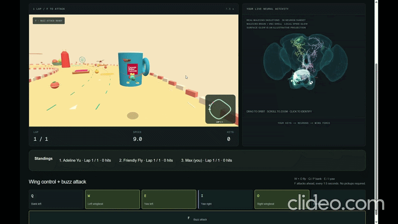
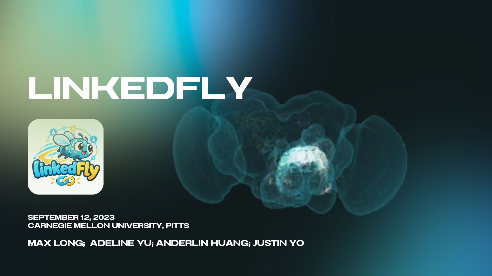

# LinkedFly

A browser-based QWOP-inspired fruit fly flight experiment. Six flight keys mapped to ten neural channels stimulate real MaleCNS pathways, and the resulting modeled motor activity drives arcade wing flight and kitchen racing.

## Demo video


- [whole demo video](https://drive.google.com/file/d/1LcSomeL8kvsorXWNa4tXkI5IL2D34jd3/view)
- [turn left demo](https://drive.google.com/file/d/1VBliqDG5gfAOw-p299sw4lrS3FmLC_KA/view)
- [turn right demo](https://drive.google.com/file/d/1jEIVXqec-JOWtbRCFTd9c5SD4zTQFyl3/view)

## Slides

[](https://canva.link/r8njx12wig71yi9)

## Run

```sh
npm.cmd ci
npm.cmd run dev
```

Open http://localhost:3000. Choose Single player, click Prepare for takeoff, then hold **W + O** to power both wings.

| Left hand / left wing | Action                           | Right hand / right wing |
| --------------------- | -------------------------------- | ----------------------- |
| Q                     | Bank / wing stroke extent        | P                       |
| W                     | Paired power + recovery wingbeat | O                       |
| E                     | Yaw / wing pitch                 | I                       |

Hold W + O to climb gently; release both to descend. Q/P bank sideways and automatically level out after release. E/I rotate your heading; release stops rotation and opposite yaw corrects the heading. Combine W + E and W + I for diagonals.

Follow the winding mint lane around a closed kitchen circuit. Start and finish share one checkered line; complete **one forward lap** to finish. Reversing across the line does not grant a lap. Flying around hazards (pink pigs, orange oranges and green grapes) boosts your score; colliding with them costs health and resets your combo.

Replay captures the latest approximately 12 seconds at one-third speed, interpolating every animation frame from recorded timestamps, including consumed food, boosts and stun state. In single player, click Replay to watch your best attempt and verify the finish.

The neural panel includes the public MaleCNS brain and VNC neuropil shells, aligned with the original skeleton coordinate transform. Local surface glow projects nearby simulated spike pulses onto the morphology; only the ten simulated two-hop pathways emit glowing pulses during motor activity. Actual recorded spike counts and muscle outputs appear in the bottom readout.

## Data and model

30 actual MaleCNS v1.0 skeletons, 141 measured connections in the export, and ten selected two-hop paths containing 20 simulated measured edges. The remaining edges are not simulated. Original morphology (CC-BY 4.0) rescaled and aligned in app. The LIF neuron model integrates current (one spike → 1 nA and muscle stimulation → 8 nA pulses) and outputs spikes at the model's resting potential threshold. Muscle activation integrates spikes independently, with no saturation, and drives flight wing-beat frequency and wing stroke extent—key degrees of freedom in an arcade version of Drosophila aerial biomechanics.

Use uv to reproduce the data asset:

```sh
uv run scripts/build_circuit.py --weights /tmp/fly-weights.feather
```

Download raw annotations and weights as documented in the provenance file first. Raw research files and Python environments are ignored by Git; the extracted game asset is committed.

## Architecture

- `public/neural-worker.js`: LIF neuron simulation; keyboard inputs only stimulate input neurons. Only actual modeled output spikes generate muscle activation.
- `lib/simulation.ts`: deterministic arcade biomechanics and kitchen collisions and finish detection.
- `components/BrainView.tsx`: Three.js actual morphology, selection, orbit, and illustrative event pulses.
- `components/RaceView.tsx`: Three.js course, fly, and chase camera.
- `app/page.tsx`: controls, worker lifecycle, pause/reset, replay and display.

## Verification

```sh
npm.cmd test
npx.cmd tsc --noEmit
npm.cmd run build
```

Tests cover real pathway independence, connection ablation, launch, fatigue, kitchen collisions, one-lap progression, reverse/shortcut rejection, food refresh, replay interpolation, and innate attack direction. All must pass before deployment.

Data: MaleCNS/FlyEM, HHMI Janelia Research Campus, Google Research and collaborators, CC-BY 4.0. Artificial muscle-action assignments and simulation constants are documented in-app.

Map concept, routes, hazards, modular assets and multiplayer scope: [Kitchen design](KITCHEN_DESIGN.md).

CMU logo stickers on selected kitchen props use the original image from [CMU Brand Standards](https://brand.cmu.edu/visual-identity/carnegie-mellon-trademarks/university-logo). The kitchen theme and contest scope are inspired by the original Pokémon Snap arcade experience, captured in this flight variant.

## Multiplayer demo (browser host, no separate game server)

The creator is the host. The host browser runs every racer's neural worker, authoritative 60 Hz race simulation, lap counting, countdown and attack checks. Guests send only key states; approximate missile and food state is synchronized by the host. A WebSocket relay runs on the host's dev port to forward messages to guests.

**Two connection modes (both players must select the same mode):**

- **Same website · LAN demo (recommended)** is selected automatically when the updated dev server is detected. The existing website forwards WebSocket messages on its own port; it does not simulate separately, reducing latency and complexity.
- **WebRTC · direct connection** preserves the original browser-to-browser mode. Internet access to the [PeerJS public PeerServer](https://peerjs.com/client/getting-started) is required for room discovery, but not for actual gameplay after both browsers exchange connection details.

### One computer, two windows

1. Install Node 22.13+ and run `npm.cmd ci`, then `npm.cmd run dev` from this folder. On macOS/Linux use `npm` instead of `npm.cmd`. The `.cmd` form avoids PowerShell's `npm.ps1` execution-policy prompt.
2. Open `http://localhost:3000` in **two separate browser windows**, positioned side by side. Keep the host visible and do not minimize it. Chrome/Edge are suitable; no camera or microphone permission is required.
3. Window A: fill in the profile and choose an outfit → Multiplayer → keep Same website selected → Create room. Its eight-character code identifies the room, and the creator is automatically the host.
4. Window B: choose a different name and outfit → Multiplayer → select the same connection mode → enter A's code → Join room. Both windows should show both players. Only A sees Start race; it is not visible until all guests have joined.
5. Click Start race in A. Both should show the same 3-second countdown, then race timer. Click the window to control that racer; hold W + O to take off. One keyboard controls only the focused window. Both flies and missiles render on both screens and stay in sync. Chat is not included; teams may use video conference audio.
6. When the first player completes one lap, everyone immediately sees results and social cards; unfinished players are marked DNF. The host can choose Race again. A guest closing its window is removed from the room. When the host closes, all guests see a notice and return to the main menu.

### Multiple computers: separate website on each computer (WebRTC only)

Each computer checks out the **same version**, runs `npm.cmd ci` and `npm.cmd run dev`, and opens its own `http://localhost:3000`. Both MUST change Connection mode to **WebRTC** before creating/joining; Same website will not work across separate dev processes.

### Multiple computers: shared website (recommended for the demo)

On the laptop serving the page:

```powershell
npm.cmd ci
npm.cmd run dev -- --hostname 0.0.0.0
ipconfig
```

Find the Wi-Fi IPv4 address, e.g. `172.26.101.153`. ALL players open `http://172.26.101.153:3000`, choose Multiplayer, and select **Same website · LAN demo**. One player creates a NEW room and shares its eight-character code with others to join.

If Windows prompts, permit Node on the trusted **Private** network. Do not disable the firewall. The website needs to be reachable from each computer, including its WebSocket endpoint on the same port.

No SSH is necessary. The Same website mode already uses the reachable website connection for game messages.

### Combat and race rules

- Before creating a room, use **Flight speed** to choose **1×–5×** in 0.25× steps (default 1×). The host's setting applies to every player and is shown in the room; guests joining use the room's value.

- Six movement keys stay **Q W E / I O P**. **F** is a permanently available forward buzz attack, including an on-screen button. Hold to repeat every 1.5 seconds; no inventory or attack pickups.
- Hits reach up to 8 world units inside a forward cone (roughly ±49°), within 3 vertical units. They cannot hit behind you, during countdown, while stunned, or after finishing. The expanding glow pulses when a successful hit lands.
- A hit drops the victim to the counter, then rests for 1.2 seconds. Recovery grants 2 seconds of immunity. Progress survives a hit. Food remains a speed boost, independent of combat.
- Finish times use the host's common race clock, including time spent waiting to launch or stunned. One lap wins and freezes the race for everyone. Late joins are rejected during a race; rooms allow rejoin only before the countdown.
- Single player retains pause, training pace and replay. Multiplayer has no local pause/slow-motion or replay that could desynchronize the match.

### Hackathon checklist and limitations

Before presenting, verify two names appear in both lobbies, countdown/timer agree, both flies move on both screens, F visibly stuns a nearby opponent, food boosts, one lap → shared results and matching times, and both guests see host-exit notice.

If the room times out, first check the connection mode on BOTH computers. For Same website, check that both URLs reach the same updated dev process; restart it and recreate the room. For WebRTC, ensure both browsers can reach the PeerServer and check browser console for errors.

Verified in this implementation: 36 automated tests, TypeScript checks, scoped lint and production build. The new relay test checks real WebSocket clients, large result payloads, room isolation and cleanup. Host exit and rejoin logic are covered. Multiplayer gameplay is spotty in CI without a stable WebSocket relay; local testing with two browsers is strongly recommended.

Earlier WebRTC QA verified create/join, host-only start, shared clock and host exit notification. A temporary test fixture also triggered the host finish state and verified that the guest received the result payload.

## Profiles, outfits and post-race social cards

The first screen is a profile/outfit editor: optional display name, school/program/year, interests, short bio, profile website and connect link. Six preset body colors plus a custom color picker, and eye/wing variants. Changing outfit refreshes the card animation but does not affect gameplay; all flies have the same collision shape.

Only your own profile is saved locally (`flycircuit-profile-v1` in browser storage). The profile you submit is shared with everyone in your room, so enter only information you want them to keep. All fields are optional.

The first one-lap finisher ends the race for everyone. Finishers get a host-clock race time (centiseconds); everyone else has DNF rather than a fabricated finish time. Social cards include the summary (name, school, year), total race time, rank and outfit, plus a neural animation clip from the final seconds.

Connect opens the player's supplied connect URL (for example LinkedIn) in a new tab; it does not silently send a message or create a friendship record. View Profile opens the full profile and its link in a new window. The card PNG and GIF are purely local and never uploaded.

Each host worker records up to 30 neural frames over the last approximately 3 seconds of racing, then freezes them at the finish. The card animates the recorded spike IDs and muscle outputs over a tiled fly render; the card layout is fixed at 960 × 720.

- **Save PNG**: 960 × 720 card, using the most active recorded spike frame from the final clip.
- **Save GIF**: 640 × 480 animated card with the recorded signal timing, encoded locally with [gifenc](https://github.com/mattdesl/gifenc). A progress indicator appears while encoding. No record is sent to servers; the download is browser-local.

Image exports include the player's links as readable text; interactive Connect/View Profile buttons belong to the website. Image downloads do not automatically publish anything. Test exports with your profile before the event.
